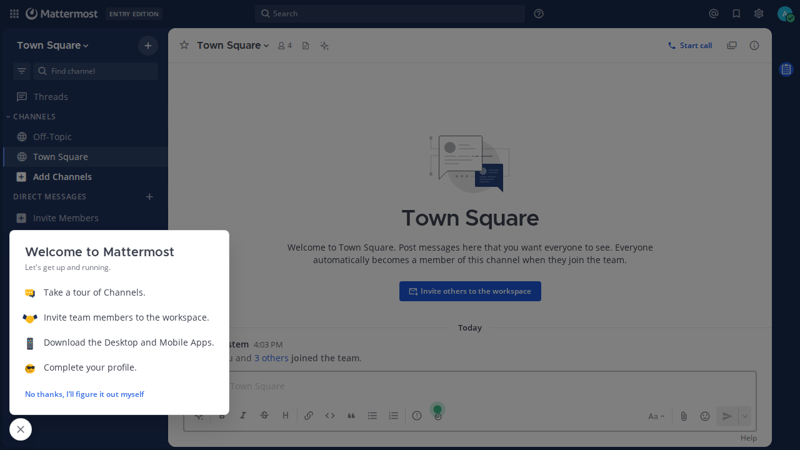

# Mattermost SSL Auth

## About the project

Client-certificate (x509) single sign-on for [Mattermost](https://mattermost.com) behind an OpenResty reverse proxy. A port of [fl0l0u/gitlab-ssl-auth](https://github.com/fl0l0u/gitlab-ssl-auth) (Apache-2.0) from GitLab to Mattermost.

The browser presents a client certificate over TLS; the gateway maps that certificate to a Mattermost user, logs the user in server-side, and proxies the session. Users never see — or type — a password, and no Mattermost session cookie ever reaches the browser.



## How it works

```
 +---------+  TLS + client cert   +--------------------------+  HTTP, loopback   +-------------+
 | browser | -------------------> | OpenResty :443           | ----------------> | Mattermost  |
 |         | <-------------------- | gateway (Lua)            | <----------------- | 127.0.0.1  |
 +---------+  proxied response;   +----------+---------------+  session replayed  | :8065      |
            no Mattermost cookies          |                                    +-------------+
            ever reach the browser         | per-user session:
                                           | cookies + token + password
                                           v
                                        +---------+          create / repair user,
                                        |  Redis  | <-------> team join, rotate
                                        +---------+          password (admin API,
                                           x509auth:            system-admin PAT)
                                           <email>:{password,
                                            cookies, token}
```

1. The browser opens `https://mattermost.example.test` presenting a client certificate signed by the trusted client CA (`ssl_verify_client on` — requests without a valid certificate are refused at the TLS layer).
2. The gateway parses the certificate DN: email attribute → username, name attribute → display name, `OU=Admins` → system admin.
3. If no session is stored for that user yet, the gateway resolves a password (provisioning the user via the admin API when `ALLOW_PROVISION=true`), logs in against `/api/v4/users/login`, and stores the resulting session cookies and Bearer token in Redis.
4. Every forwarded request gets `Cookie`, `X-CSRF-Token` and `Authorization` overwritten from the stored session, so the browser never carries Mattermost session material.
5. The stored session is kept alive by an **access-phase liveness check** ([ADR 0002](docs/adr/0002-session-renewal-replay.md)): throttled per user to one check per `SESSION_CHECK_INTERVAL_SECONDS` (60 s), it first compares the session's age against `SESSION_MAX_AGE_HOURS` (20 h) and, if still fresh, probes it with a `GET /api/v4/users/me`. An over-age or 401-probed session is re-logged in **while the request is still in flight**, under the per-user Redis lock; the check never fails the request (a failed renewal restores the previous session and the next request retries). The webapp itself never requests `/login` — it routes to the login screen client-side — so `/login` is a manual trigger only: a navigation there drops and re-logs in the session, then 302s back to the `Referer` (same-origin only, else `/`).
6. A pure-Lua header filter **hydrates the browser's cookie jar**: on `location /` the gateway sends the stored `MMAUTHTOKEN`, `MMUSERID` and `MMCSRF` as `Set-Cookie` (attributes mirror Mattermost's own login response — `HttpOnly` on `MMAUTHTOKEN` only, `Secure` only over TLS), so a fresh browser boots straight into the logged-in app even though no Mattermost cookie ever crosses the wire.
7. WebSocket traffic on `/api/v4/websocket` gets the same session injection during the HTTP Upgrade request.
8. The gateway is fail-closed: a missing or invalid client certificate is refused (400), and any failure in Redis, Mattermost, or the provision token aborts the request with an error — nothing is proxied unauthenticated.

## Features

* Per-certificate user mapping from the DN (`emailAddress`, `CN`, `OU`)
* Self-healing login: a stale cached password is rotated, a soft-deleted (deactivated) user is reactivated, and a hard-deleted user is re-provisioned — transparently, through the admin API
* `OU=Admins` certificates are provisioned as `system_admin`
* New users are added to the default team automatically
* Session state in Redis — survives gateway restarts
* Session liveness check: an over-age (`SESSION_MAX_AGE_HOURS`) or dead (401-probed) stored session is re-logged in during the request itself, throttled per user (`SESSION_CHECK_INTERVAL_SECONDS`) — invisible in steady state; after a sudden invalidation at most ~60 s of 401s before the transparent in-access renewal ([ADR 0002](docs/adr/0002-session-renewal-replay.md))
* Fresh-browser cookie-jar hydration: the stored session's cookies are set on the browser at `/`, so a fresh browser boots straight into the logged-in app
* `/login` remains a manual renewal trigger (the webapp never requests it — client-side routing)
* WebSocket support (`/api/v4/websocket`)
* Audit access log: every request records the presenting certificate (verify status, fingerprint, DN); sensitive query params (`token`, `code`, `invite_id`) are redacted

## Quick start

TL;DR — on a fresh Ubuntu 24.04 box:

```bash
git clone <this-repo> mattermost-ssl-auth && cd mattermost-ssl-auth
sudo bash example/demo_install.sh
```

The script installs everything (OpenResty, Mattermost 11.x, PostgreSQL, Redis), provisions the first admin + provisioning PAT + default team, builds the demo PKI, deploys the gateway, and starts the `mattermost-ssl-auth` service. Then add `mattermost.example.test` to `/etc/hosts`, import `example/certs/flo.pfx` into the browser (trusting `example/ca/root-ca.crt`), and open `https://mattermost.example.test`.

Manual installation and PKI details: [`example/README.md`](example/README.md).

## Packaging (.deb)

The gateway ships as a deb (`Architecture: all` — the payload is configuration + Lua, no compiled code):

```bash
bash packaging/build_deb.sh    # → dist/mattermost-ssl-auth_<version>_all.deb
sudo dpkg -i dist/mattermost-ssl-auth_<version>_all.deb
# or: sudo apt ./dist/mattermost-ssl-auth_<version>_all.deb
```

The package **vendors** [lua-resty-http v0.17.1](https://github.com/ledgetech/lua-resty-http) — a top-level runtime `require` of the gateway — into `/usr/local/openresty/nginx/lua/resty/` (MIT; license text in `LICENSE`), so no external fetch is needed at install time.

Fresh-machine prerequisites: the package `Depends:` on `openresty` and `redis-server` (apt pulls them in) and `Recommends:` `mattermost`. On top of that:

* **Mattermost** 11.x reachable at `MATTERMOST_UPSTREAM` (default `http://127.0.0.1:8065`), with a system-admin personal access token and a default team.
* **Certificates** at `/etc/ssl/private/mattermost.crt`, `/etc/ssl/private/mattermost.key` and `/etc/ssl/private/client-ca.crt` — [`example/build_certs.sh`](example/build_certs.sh) builds all of them. These can be in place **before or after** the install: `postinst` runs the nginx config test and checks the env file, and only when both pass enables the service for boot (`systemctl enable`) and starts it (fresh install) or restarts it (upgrade); otherwise it prints exactly what is missing and exits before enabling or (re)starting: on a fresh install the service is left **not started and not enabled** for boot, whereas on an upgrade a previously running service **keeps running** (postinst exits 0 without stopping it).
* **Env file**: fill in `/etc/mattermost-ssl-auth.env` (the package ships the example values as a conffile; at minimum replace the placeholders for `MATTERMOST_PROVISION_TOKEN` and `MM_DEFAULT_TEAM_ID`), then `sudo systemctl enable mattermost-ssl-auth && sudo systemctl restart mattermost-ssl-auth` — the placeholder path never enabled the unit, so a bare `restart` would leave it running but not boot-enabled.

**Layout and conffile semantics:** the whole configuration lives under `/etc/mattermost-ssl-auth/` — `nginx.conf` plus `includes/` (the packaged `server-443.conf`; a site-specific server is a `server-*.conf` dropped into `/etc/mattermost-ssl-auth/includes/` that the main conf's `server-*.conf` glob picks up on reload, and since the .deb does not ship it, it survives upgrades untouched) — and the unit is `/lib/systemd/system/mattermost-ssl-auth.service`. The package ships nothing under `/usr/local/openresty/nginx/conf/` anymore (that tree belongs to the `openresty` package), so a stock `dpkg -i` works without `--force`. Four dpkg conffiles: `/etc/mattermost-ssl-auth.env`, `nginx.conf`, `includes/proxy-common-headers.conf` and `includes/server-443.conf`. An upgrade prompts to keep a local copy when it is modified (choosing the packaged version saves your copy as `<file>.dpkg-dist`); `dpkg -r` **keeps** them all, only `dpkg --purge` removes them.

**Optional test seam:** the loopback test ingress on `127.0.0.1:18443` (development only) is **not installed** by the package — it is a DN-spoofing hook (`X-Test-DN` overrides the certificate DN) and must never be exposed beyond loopback. To opt in, copy the template [`example/server-test-18443.conf`](example/server-test-18443.conf) to `/etc/mattermost-ssl-auth/includes/` and run `sudo systemctl reload mattermost-ssl-auth`.

**Migrating from the manual [`example/demo_install.sh`](example/demo_install.sh) deployment:** the env and conf files are now dpkg conffiles, so an install over a manual deployment keeps your locally-modified copies (interactive dpkg prompts; non-interactive keeps local) — back them up first if you want to be able to compare, and delete the now-unused manual conf under `/usr/local/openresty/nginx/conf/` once the service runs from `/etc/mattermost-ssl-auth/`.

## Configuration

All settings live in `/etc/mattermost-ssl-auth.env` (template: [`src/etc/mattermost-ssl-auth.env.example`](src/etc/mattermost-ssl-auth.env.example); root-only, mode 600 — it holds a system-admin token). The file is consumed by the systemd unit's `EnvironmentFile`; changing it requires a **full service restart** (nginx `env` directives are main-context only).

| Variable | Example value | Meaning |
|---|---|---|
| `MATTERMOST_UPSTREAM` | `http://127.0.0.1:8065` | Base URL of the Mattermost instance behind the proxy (http only; TLS is terminated by the gateway) |
| `MATTERMOST_SITE_URL` | `https://mattermost.example.test` | Public URL of Mattermost (SiteURL); the Origin the login is presented from — empty (unset) synthesizes `https://<Host>` |
| `REDIS_URI` | `unix:/run/redis/redis-server.sock` | Redis for the session store — `unix:<path>`, bare `host:port`, or `redis://host:port` |
| `MATTERMOST_PROVISION_TOKEN` | `<system-admin personal access token>` | System-admin personal access token used to create/repair Mattermost users |
| `ALLOW_PROVISION` | `true` | `false` disables automatic user creation (auth only) |
| `MM_DEFAULT_TEAM_ID` | `<default team id>` | Team ID new users are added to during provisioning |
| `CERT_EMAIL_FIELD` | `emailAddress` | Subject field in the client certificate that holds the user's email |
| `CERT_NAME_FIELD` | `CN` | Subject field in the client certificate that holds the user's name |
| `CERT_ADMIN_OU` | `Admins` | Organisation Unit value that grants Mattermost admin rights (empty string disables cert-driven admin) |
| `USERNAME_FROM_EMAIL` | `true` | Derive the Mattermost username from the local part of the certificate email |
| `SESSION_MAX_AGE_HOURS` | `20` | Liveness check: a stored session older than this (hours) is renewed without probing, before the upstream can kill it (Mattermost's session TTL is 7+ days by default; 20 h keeps it safely fresh) |
| `SESSION_CHECK_INTERVAL_SECONDS` | `60` | Per-user throttle for the access-phase liveness check (age check + `users/me` probe); a dead or over-age session is re-logged in synchronously within the check |

## DN convention

The example PKI (`example/build_certs.sh`) issues:

| Certificate | DN | Provisions |
|---|---|---|
| `certs/flo.*` | `/emailAddress=flolou@simple.org/CN=Flo Lou/O=Simple Inc/OU=Admins/C=FR/ST=State/L=City/DC=simple/DC=org` | user `flolou`, display name "Flo Lou", **system admin**, added to the default team |
| `certs/aze.*` | `/emailAddress=azerty@simple.org/CN=Azé Rtÿiôµ/O=Simple Inc/OU=Users/C=FR/ST=State/L=City/DC=simple/DC=org` | user `azerty`, display name "Azé Rtÿiôµ" (non-ASCII on purpose) |

Mapping rules: the `CERT_EMAIL_FIELD` value (lowercased) is the login email; the username is its local part when `USERNAME_FROM_EMAIL=true`; the `CERT_NAME_FIELD` value is split on the first space into first/last name; a certificate whose `OU` equals `CERT_ADMIN_OU` is granted `system_admin`.

## Prerequisites

* Ubuntu 24.04 LTS server (the demo target; any distro with OpenResty works)
* A client CA you control (the demo builds one)
* Mattermost 11.x reachable over plain HTTP (the gateway terminates TLS)
* Redis for the session store

## Caveats

* Session liveness is checked in the access phase, throttled per user: after a sudden session invalidation (revoke, server-side kill) up to one `SESSION_CHECK_INTERVAL_SECONDS` window (~60 s) of 401s may reach the browser before the transparent in-access renewal rotates the token — the browser recovers on its next request or a refresh; see [ADR 0002](docs/adr/0002-session-renewal-replay.md) (supersedes [ADR 0001](docs/adr/0001-login-only-session-store-refresh.md)).
* `/login` is a manual trigger only: the webapp never requests it, because a dead session makes the SPA route to the login screen client-side instead of issuing a request.
* The proxy normalizes the forwarded WebSocket `Origin` to the SiteURL (`MATTERMOST_SITE_URL`), but **only when the Origin's host matches the SiteURL's host** (any or absent port — a port-only rewrite) — Mattermost compares the Origin to the SiteURL with the port literal, so a browser on a non-default port would otherwise be rejected. A different (cross-origin) host is passed through untouched and rejected by Mattermost, so the drive-by WebSocket read stays blocked; see [ADR 0002](docs/adr/0002-session-renewal-replay.md).
* Renewal does not revoke the previous Mattermost session server-side — the gateway simply stops replaying it, and the old session expires by its own ~7-day TTL.
* Mattermost rate-limits login (5 rps / burst 10); the gateway backs off and retries (up to 3 attempts).
* `MATTERMOST_PROVISION_TOKEN` is a **system-admin** personal access token — keep `/etc/mattermost-ssl-auth.env` at mode 600, root-only.
* `ALLOW_PROVISION=false` is read-only mode: existing users can still authenticate, unknown certificates are never created.
* Username collisions (two certificates whose email local-parts match but whose full emails differ) fail closed with a clear error — the second certificate is not provisioned.
* One FQDN per gateway — the server name is baked into the conf tree (`nginx.conf` + `includes/`).
* `ssl_verify_client on` is required; the gateway refuses any request without a valid client certificate.
* Tested end-to-end against Mattermost 11.10.1 (API behavior source-checked); other 11.x versions should work, but verify your version.

## Testing

The repo ships a loopback-only test ingress template (`example/server-test-18443.conf`, `127.0.0.1:18443`, development only) that runs the full proxy pipeline over plain HTTP: instead of a TLS client certificate, it takes the already-unpacked DN from the `X-Test-DN` header, emulating what the real reverse proxy does. The .deb does not install it (see the packaging section); enable it by copying the template to `/etc/mattermost-ssl-auth/includes/` and reloading.

```bash
curl -H 'Host: mattermost.example.test' \
     -H 'X-Test-DN: emailAddress=who@example.test,CN=Who Test,OU=Users,O=Example Org' \
      http://127.0.0.1:18443/
```

This exercises provisioning, login, session replay, and self-healing without a client certificate. The `Host` header must be the FQDN so the Origin forwarded to Mattermost matches its SiteURL. The production `:443` server pins the test variable to empty, so it is unaffected.

Browser scenarios P0–P6 were additionally verified with Playwright against the reference VM: P0 no-DN → 400; P1 fresh-browser cold start boots logged in (0×401 out of 47 requests, jar hydrated); P3 server-side session revoke → 401s only inside the 60 s throttle window, then transparent in-access renewal (token rotated, no `/login` navigation, no reload); P4 forced-stale age → renewal; P5 OU=Admins → system_admin; P6 warm session in a fresh browser → straight to the app, zero logins. A two-user test (flo→aze and aze→flo) delivered messages both directions with 0×401/0×5xx (live unread badges are not observable in headless; browser WebSockets work on the test ingress via same-host Origin normalization, see the Origin caveat above; live delivery was proven at protocol level on the production path).

The pure-Lua same-host `Origin` helpers ([`mattermost_origin.lua`](src/usr/local/openresty/nginx/lua/mattermost_origin.lua) — the logic behind the WebSocket `Origin` normalization caveat above) have a dependency-free unit test that runs on stock LuaJIT (no OpenResty):

```bash
luajit test/origin_test.lua   # from the repo root
```

On an installed gateway: copy `test/origin_test.lua` next to the module, then `cd /usr/local/openresty/nginx/lua && /usr/local/openresty/luajit/bin/luajit origin_test.lua`.

## License

Distributed under the Apache-2.0 License. See `LICENSE` for more information.

A port of [fl0l0u/gitlab-ssl-auth](https://github.com/fl0l0u/gitlab-ssl-auth) (Apache-2.0) by fl0l0u.
